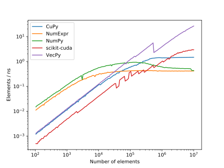

# VecPy


VecPy is a lightweight GPU-accelerated Python package that lets you perform vector operations such as
summation, and elementwise computation. VecPy can deliver great performance when it comes to working with large
arrays. It uses just-in-time compilation, cached compiling, and lazy evaluation to avoid temporary
memory allocation and deallocation. The package is currently very much
in a experimental state and very limited in terms of what it can do. If you do decide to try it
out, please keep that in mind.

## Performance
VecPy has been tested for a few different problems and benchmarked against other packages. 
The example below demonstrates that VecPy can be an order of magnitude or more faster than the
alternatives for large data
sets (millions of elements).



See the [benchmarks](https://ooreilly.github.io/vecpy/docs/benchmarks/sum) page for further details, and additional performance tests.

## Usage
Using VecPy is about as easy as using NumPy, except that you need to transfer results to and from
the GPU. This section demonstrates the basic usage and features of VecPy by computing the [Pythagorean
trigonometric identity](https://en.wikipedia.org/wiki/Pythagorean_trigonometric_identity) for each element in a vector `u`.

### Summation
Since the Pythagorean trigonometric identity is equal to one for any angle, if you apply this
identity to each element in the vector `u` and sum the result you must get the length of the vector
back. Here is how to implement and check this property in vecpy.

```py
>>> import numpy as np
>>> import vecpy as vp
>>> n = 1000
>>> u = np.random.rand(n)
>>> vu = vp.to_vecpy(u)
>>> sum = vp.sum(vp.cos(vu)**2 + vp.sin(vu)**2)
>>> sum.get()
array([1000.])
```
The function `to_vecpy()` allocates  a new array of the same shape and type as `u` on the device and copies its values.
Make sure to call the method `get()`to transfer the result from the device to the host. Note that
the call `sum.get()` returned  `array([1000.])`, which is the length of `u` but as a floating-point number. This is because VecPy performed the accumulation using double precision.

### Elementwise computation
Unlike Numpy, no computation takes place if you only write the expression `vp.cos(vu)**2 + vp.sin(vu)**2`. If you want to perform the elementwise computation of this expression and place the result in a new array, you need to explicitly state that. 
```py
>>> vr = vp.elementwise(vp.cos(vu)**2 + vp.sin(vu)**2)
>>> vr.get()
array([1., 1., 1., 1., 1., 1., ... 1.])
```
Note that the function call `vp.elementwise` will allocate a new array for you. If you want to reuse
an old array you can do so as well. 
```py
>>> vr = vp.zeros_like(u)
>>> vp.elementwise(vp.cos(vu)**2 + vp.sin(vu)**2, out=r)
>>> vp.elementwise(vp.cos(vu)**2 + vp.sin(vu)**2, out=r)
>>> vr.get()
array([1., 1., 1., 1., 1., 1., ... 1.])
```

### Shapes
The shape of the array does not matter as long as all arrays have the same shape.
```py
>>> A = np.ones((n, n))
>>> vA = vp.to_vecpy(A)
>>> sum = vp.sum(vA)
>>> sum.get()
array([1000000.])
```

### Functions
If you encounter a situation in which a math
function you need is not implemented, you can implement it yourself as a work-around (as long as it
is part of the [CUDA Math library](https://docs.nvidia.com/cuda/cuda-math-api/index.html)). For example,
here is how to implement the [Gamma](https://en.wikipedia.org/wiki/Gamma_function) function:
```py
>>> gamma = lambda x : vp.function("tgamma", x)
>>> vy = vp.elementwise(gamma(u))

```


## Installation
Clone the repository, and install via pip
```bash
$ pip3 install .
```
After the installation is complete, you can test the package by running
```
$ bash pycov.sh
```
This step requires `pytest`.

## Requirements and dependencies
To use VecPy, you need:
* NVIDIA CUDA-enabled GPU
* Python 3.x
* pyCUDA, NumPy

## Documentation
See the [documentation](https://ooreilly.github.io/vecpy) page for API reference documentation.
 
## Contribute
Contributions are welcome. 
If you discover an issue with VecPy, please report it using the issue tracker. Unfortunately,
feature requests are not available at this time. 

